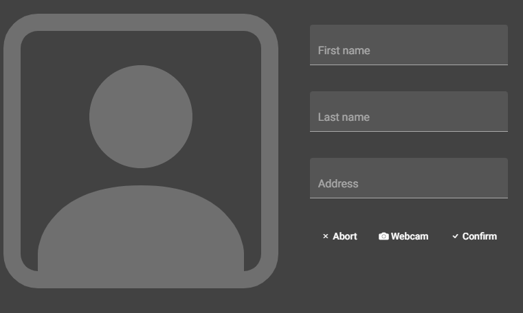
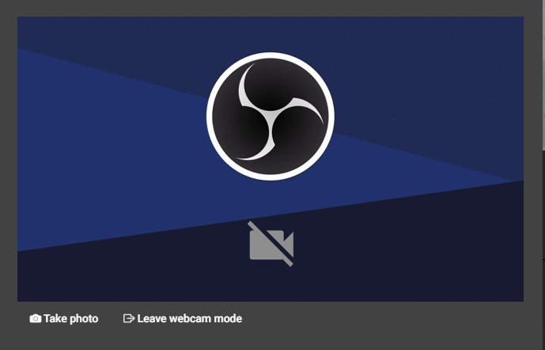
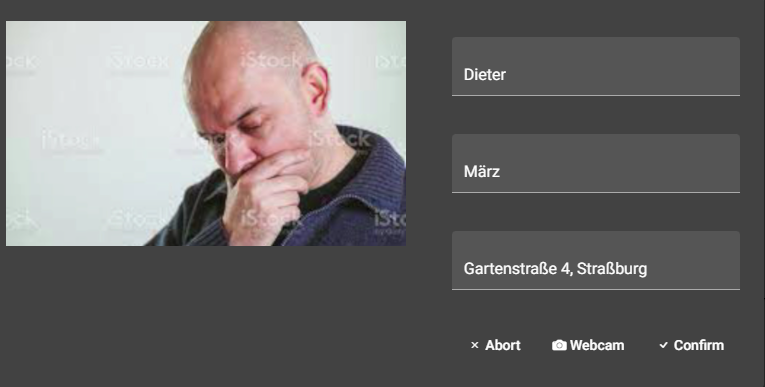
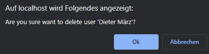
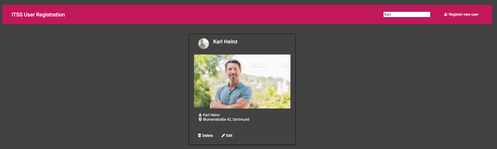

# ITSS Kunden Registrierung

Erfassung von Kundendaten mittels Angular, ASP.NET und MySQL.

## Requirements
- Mit Docker:
    - docker-compose CLI
- Ohne Docker:
    - Node.js v16.x
    - NPM v8.x
    - ASP .NET v5.0
    - .NET v5.0
    - MySQL Host v8.0.x

## Installation und Ausführen
 - Mit Docker:
    1. Installation mit `docker-compose build`
    2. Ausführen mit `docker-compose up` oder über Docker Desktop GUI
    3. Das Frontend ist unter [localhost:80](http://localhost:80) erreichbar
 - Ohne Docker:
    1. Installieren der benötigten Komponenten
    2. Starten des MySQL Hosts
    3. Starten des Backends
    4. Starten des Frontends mit `ng serve`
    5. Das Frontend ist unter [localhost:4200](http://localhost:4200) erreichbar

## Benutzung
### Anlegen von Nutzern
1. Klicken auf 
2. Es erscheint das Fenster zum anlegen und bearbeiten neuer Kunden:

3. In den Feldern auf der rechten Seite können die Daten des Kunden eingetragen werden
4. Durch Klick auf das Kundenbild oder auf **Webcam** kann ein Bild aufgenommen werden:

    1. **Webcam** Speichert dabei den aktuellen Frame des Videostreams als Kundenbild, **Leave webcam mode** verlässt den Kameramodus, ohne ein Bild aufzunehmen
5. Die Kundenregistrierung muss anschließend mit drücken auf **Confirm** bestätigt werden, mit drücken auf **abort** kann sie abgebrochen werden

### Bearbeiten von Nutzern
1. Das Bearbeiten von Kunden erfolgt analog zur Kundenerstellung, der entsprechende Dialog kann durch klicken auf **edit** innerhalb einer Kundendkarte geöffnet werden:

2. Im Gegensatz zur Kundenerstellung sind die entsprechenden Felder hier bereits mit den existierenden Daten gefüllt

### Löschen von Nutzern
1. Das Löschen von Kunden aus der Kundenkartei erfolgt über Klick auf den **Delete** Button innerhalb einer Kundenkarte, das Löschen muss durch Klick auf **Ok** bestätigt werden:

### Suchen von Nutzern
1. Registrierte Kunden können über das Such-Feld 
 mittels ihren vollständigen Namens gesucht und gefunden werden:

## Softwarebeschreibung
### Das Backend
### Das Frontend
### Containerisierung 

## Roadmap

## Sicherheit
