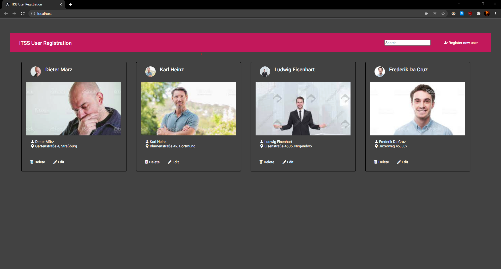

# ITSS Kunden Registrierung

Erfassung von Kundendaten mittels Angular, ASP.NET und MySQL.

## <ins>Requirements<ins>
- Mit Docker:
    - docker-compose CLI
- Ohne Docker:
    - Node.js v16.x
    - NPM v8.x
    - ASP .NET v5.0
    - .NET v5.0
    - MySQL Host v8.0.x

## <ins>Installation und Ausführen<ins>
 - Mit Docker:
    1. Installation mit `docker-compose build`
    2. Ausführen mit `docker-compose up` oder über Docker Desktop GUI
    3. Das Frontend ist unter [localhost:80](http://localhost:80) erreichbar
 - Ohne Docker:
    1. Installieren der benötigten Komponenten
    2. Starten des MySQL Hosts
    3. Starten des Backends
    4. Starten des Frontends mit `ng serve`
    5. Das Frontend ist unter [localhost:4200](http://localhost:4200) erreichbar

## <ins>Benutzung<ins>
### <ins>Anlegen von Nutzern<ins>
1. Klicken auf 
2. Es erscheint das Fenster zum anlegen und bearbeiten neuer Kunden:

3. In den Feldern auf der rechten Seite können die Daten des Kunden eingetragen werden
4. Durch Klick auf das Kundenbild oder auf **Webcam** kann ein Bild aufgenommen werden:

    1. **Webcam** Speichert dabei den aktuellen Frame des Videostreams als Kundenbild, **Leave webcam mode** verlässt den Kameramodus, ohne ein Bild aufzunehmen
5. Die Kundenregistrierung muss anschließend mit drücken auf **Confirm** bestätigt werden, mit drücken auf **abort** kann sie abgebrochen werden

### <ins>Bearbeiten von Nutzern<ins>
1. Das Bearbeiten von Kunden erfolgt analog zur Kundenerstellung, der entsprechende Dialog kann durch klicken auf **edit** innerhalb einer Kundendkarte geöffnet werden:

2. Im Gegensatz zur Kundenerstellung sind die entsprechenden Felder hier bereits mit den existierenden Daten gefüllt

### <ins>Löschen von Nutzern<ins>
1. Das Löschen von Kunden aus der Kundenkartei erfolgt über Klick auf den **Delete** Button innerhalb einer Kundenkarte, das Löschen muss durch Klick auf **Ok** bestätigt werden:

### <ins>Suchen von Nutzern<ins>
1. Registrierte Kunden können über das Such-Feld 
 mittels ihren vollständigen Namens gesucht und gefunden werden:

## <ins>Softwarebeschreibung<ins>
### <ins>Das Backend<ins>
Das Backend wurde im Rahmen eines ASP .NET Projekts mit Entity Framework als REST-API umgesetzt. Das Entity Framework mappt hierbei die entsprechenden Klassenmodelle zu Datenbankmodellen und kümmert sich um die Datenbankmigration und Datenbankupdates.
Die Anfragen erfolgen über einen API-Controller für die Nutzer, der einzelne CRUD-Operationen für die Nutzerdaten bereitstellt.
Nutzerbilder können über den selben Controller als Formdata hochgeladen werden, hierbei werden sie im Backend als Bild auf die Festplatte geschrieben und dem Nutzer als Base64-String zugeordnet.
Beim Abfragen der Bilder wird der entsprechende Base64-String zurückgegeben, dieser kann in HTML direkt als img-source verwendet werden.

### <ins>Das Frontend<ins>
Das Frontend wurde als Angular-Projekt umgesetzt, das Backend ist hierbei in Form von einfachen Web-Requests zum User-Controller eingebunden.
Die grafische Oberfläche ist hierbei in eine Übersichtsseite und eine Dialog-Komponente zur Erstellung und Editierung von Nutzern unterteilt.
Zur Ansteuerung der Webcam wurde das Modul [ngx-webcam](https://www.npmjs.com/package/ngx-webcam) verwendet, das sich mittels eines einfachen HTML-Tags einbinden lässt und bereits alle nötigen Funktionen, wie beispielsweise das Konvertieren des aufgenommenen Bildes zu Base64, mitliefert.

### <ins>Containerisierung<ins>
Zur besseren Portierbarkeit und einfacheren Installation wurden zusätzliche Docker-Komponenten zur Verfügung gestellt:

#### <ins>1. Dockerfile Backend:<ins>
Automatisch generierter Dockerfile von Visual Studio.
Stellt alle Abhängigkeiten des Projekt (wieder) her und erstellt anschließend das Projekt mit seinen Abhängigkeiten. Anschließend werden die erstellten Dateien zur Bereitstellung zusammengeführt und daraus der Container erstellt.

#### <ins>2. Dockerfile Frontend:<ins>
Ruft das aktuell stable Node.js-Image von DockerHub ab und installiert darin die Angular-CLI. Ansachließend werden die benötigten Node.js Pakete installiert.
Das Frontend wird anschließend in einen Nginx-Container unter /usr/share/nginx/html gepackt, um es über den Webbrowser zu erreichen.

#### <ins>3. Dockerfile Nginx:<ins>
Erstellt einen Nginx-Container mit Konfiguration.
Die Konfiguration routet hierbei das Frontend auf localhost:80 und das Backend auf localhost:80/api (hiermit kann das Frontend im "Productive Build" (ng build) die API erreichen ohne die spezifische URL zu kennen und Variablen überschreiben zu müssen).

#### <ins>4. docker-compose.yml<ins>
Mittels docker-compose werden die einzelnen Container mit Hilfe ihres Dockerfiles hochgezogen. Umgebungsvariablen (wie beispielsweise der ConnectionString zur Datenbank im Backend) werden hierbei durch die **environment**-Schlüsselwörter gesetzt. Für das Frontend ist dies nicht so einfach möglich, deshalb wurde hier der Weg über das Nginx-Routing gewählt.
Die **depends_on**-Schlüsselwörter geben hierbei die Reihenfolge an, in der die Container gestartet werden sollen.

## <ins>Sicherheit<ins>
Das Projekt ist aktuell zur Nutzung im lokalen, firmeninternen Netzwerk konzipiert, daher sind folgende Sicherheitsbedingungen nicht implementiert:
- <ins>CORS:<ins>

    Mittels CORS sollten Cross-Origin-Requests nur aus Richtung des Frontends ermöglicht werden, um Nutzung der API von anderen Hosts zu unterbinden.

- <ins>Nutzer-Authentifizierung und Rollen:<ins>

    Damit nicht jeder Besucher des öffentlichen Frontends Nutzerdaten einsehen, editieren oder löschen kann, sollten den Nutzern entsprechende Rollen zugeordnet werden können.
    Dementsprechend müsste auch die Möglichkeit einer Nutzer-Registrierung und Authentifizierung geboten werden.

- <ins>API-Authentifizierung:<ins>

  Entsprechend der Nutzerrolle sollte der API-Zugriff erlaubt oder unterbunden werden, damit nicht jeder Nutzer ausgehend vom Frontend beliebige Anfragen an das Backend schicken kann.
